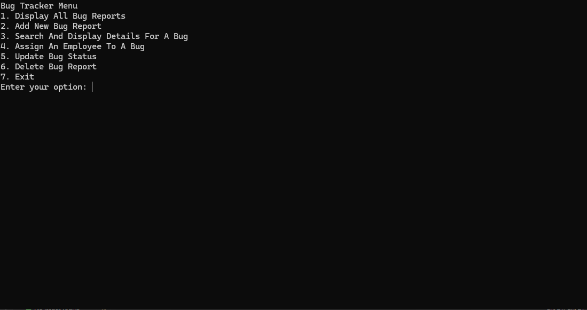
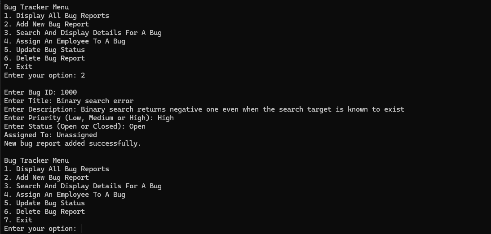
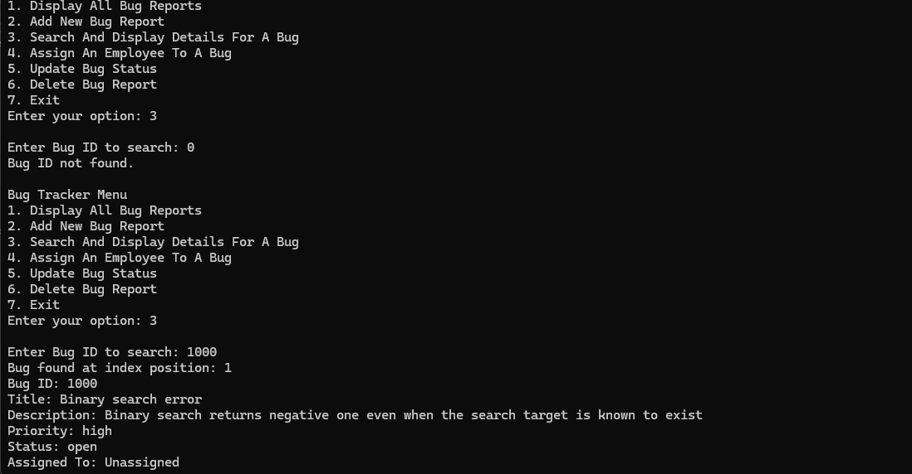
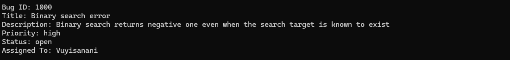
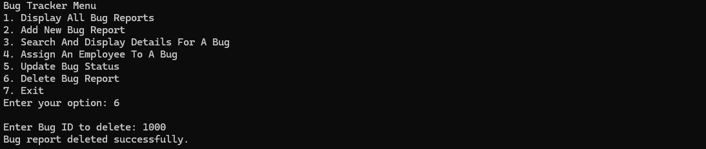
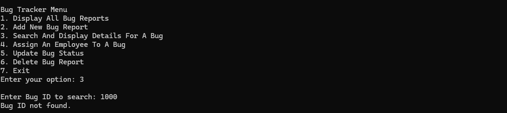

# Console Bug Tracker System

A robust, CLI-based Bug Tracking System built in C# to manage software issues efficiently. This project demonstrates backend logic, custom data structures, and algorithmic implementation without relying on pre-built collection sorting methods.

  

## 🚀 Key Features

* **Soft-Delete Architecture:** Implements a logical deletion system where records remain in the database (for integrity) but are removed from the search index.
* **Custom Algorithms:**
    * **QuickSort:** A recursive implementation (O(n \log n)) to sort Bug IDs.
    * **Binary Search:** An optimized search algorithm (O(\log n)) for instant lookup of bug reports.
* **Persistence:** Automated saving and loading of data via text file parsing (`BugData.txt`).
* **Data Integrity:** Input validation prevents database corruption (e.g., delimited text handling).

## 🛠️ Technical Implementation

* **Language:** C# (.NET Framework)
* **Architecture:** Separation of concerns between Indexing (`BugIDIndexList`) and Data Storage (`BugDatabase`).
* **Safe I/O:** Usage of `TryParse` and Guard Clauses to prevent runtime crashes.

## 💻 How to Run

1.  Clone the repository.
2.  Open the solution in **Visual Studio**.
3.  Run `Program.cs`.
4.  *Note: The application will automatically generate the `BugData.txt` file on the first launch if it does not exist.*

## 🏃‍➡️ Brief Walkthrough

### Adding a New Bug

### Search Functionality

### Update Details

### Deletion

